> All we have to do is decide what to do with the time that is given to us. 

*Gandalf by J.R.R. Tolkien*

# About Me
Hey there, and welcome to my personal page! My full name is Pei Junwei, and I like anything to do with computer or game development!

Feel free to take a look at some of the exciting stuff I had going on!

# Work Experience

## CSIT
---
I am currently working here with a focus in cybersecurity!

## Ubisoft Singapore
---
This was an exciting time in my career to actually explore working in a triple-A game industry in Singapore! I get to join Ubisoft under their [C++]ampus Apprenticeship programme and am very lucky to experience two teams!

### **Apprenticeship**
+ In general:
  + I get to actively participate in each sprint planning process which includes setting of objectives and follow up of assigned tasks 
  + Gain experience in the Agile methodology, including usage of JIRA as used in the game development process 
  + Collaborate in cross-functional teams with game designers, artists and development testers professionally 

+ Gameplay UI
  + I get to participate in the sprint cycles with JIRA tasks and contribute code to the unannounced game!
  + I was involved in UI, dealing with the Model-View-ViewModel (MVVM) paradigm and contributed code with various in-house tools/Visual Studios C++.
  + I also worked with Technical Artists and UX designers to support JIRAs.

+ Rendering
  + I've learnt to design and write simple C++ [renderer](https://github.com/pjunwei95/myRenderer) from scratch, including simple array libraries, FPS controller and math library

### **Digipen**
I also have to attend lessons twice a week under Digipen Singapore which consists of C, C++ and introduction to OpenGL Graphics.

Here are some of the notable projects:

 Conway's Game of Life | Simple platformer
:-------------------------:|:-------------------------:
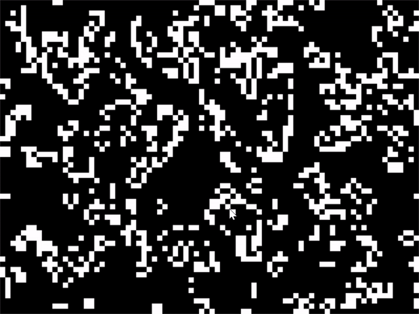 | 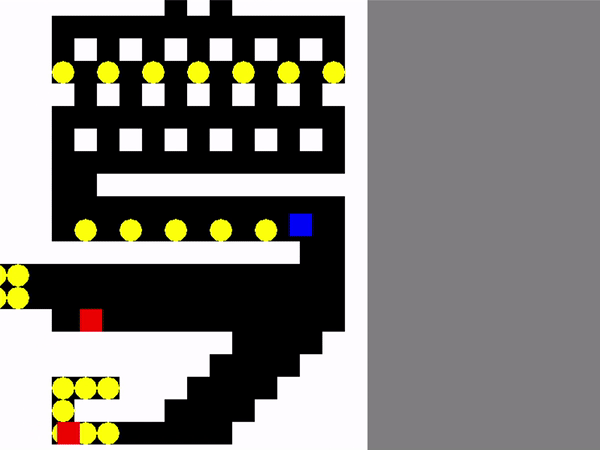

**Sudoku Solver**
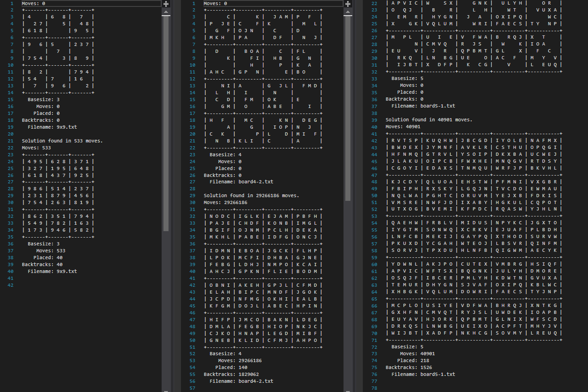

## SkillsFuture Singapore
### Blockchain Grant-Administration
This was a company-wide proof-of-concept that tests the viability of the blockchain technology.

 Blockchain visualisation | Blockchain back-end
:-------------------------:|:-------------------------:
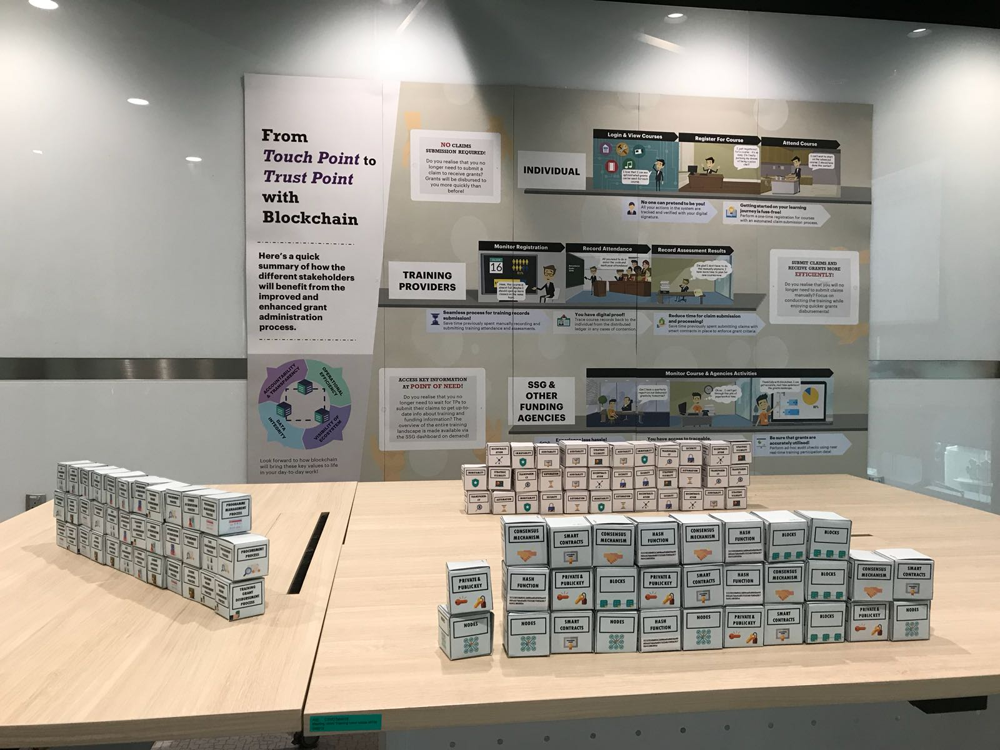 | 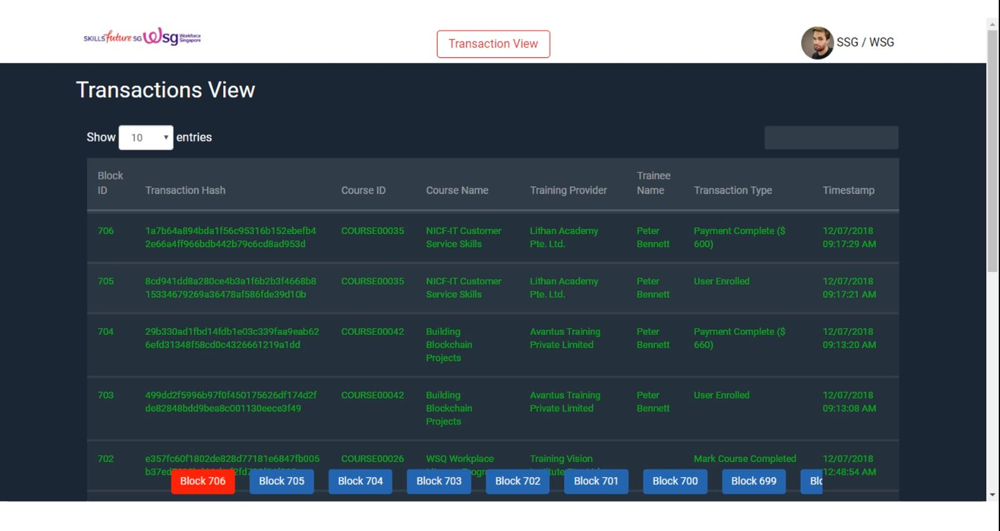

### Skills Taxonomy Harmoniser (STH)
I designed and coded this Java app from scratch which utilises NLP and text classification to categorise skills taxonomies. It uilises Mongodb for its database and JSON for network communications.

 Overview of STH | Command-Line
:-------------------------:|:-------------------------:
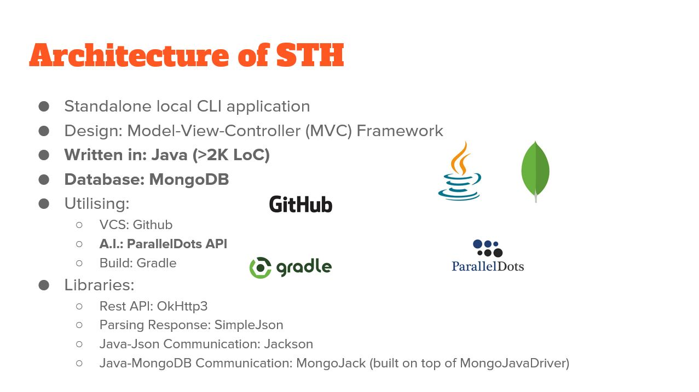 | 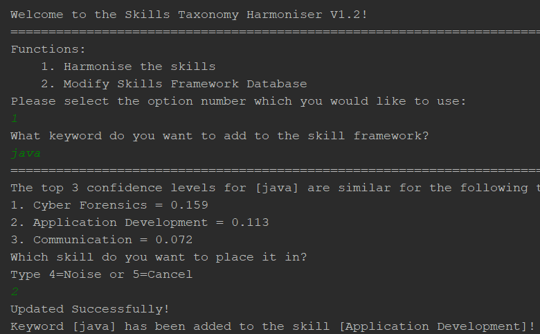

# Education
These are selected modules that are notable for their interesting projects involved.

## NM3216 - Game Design
This is a pretty cool mod which exposes me first to game development and I get to work with people from different faculty background to create our very own game! It was a fun passion project that we created.

### Mirage Opening

 Main Menu | Gameplay
:-------------------------:|:-------------------------:
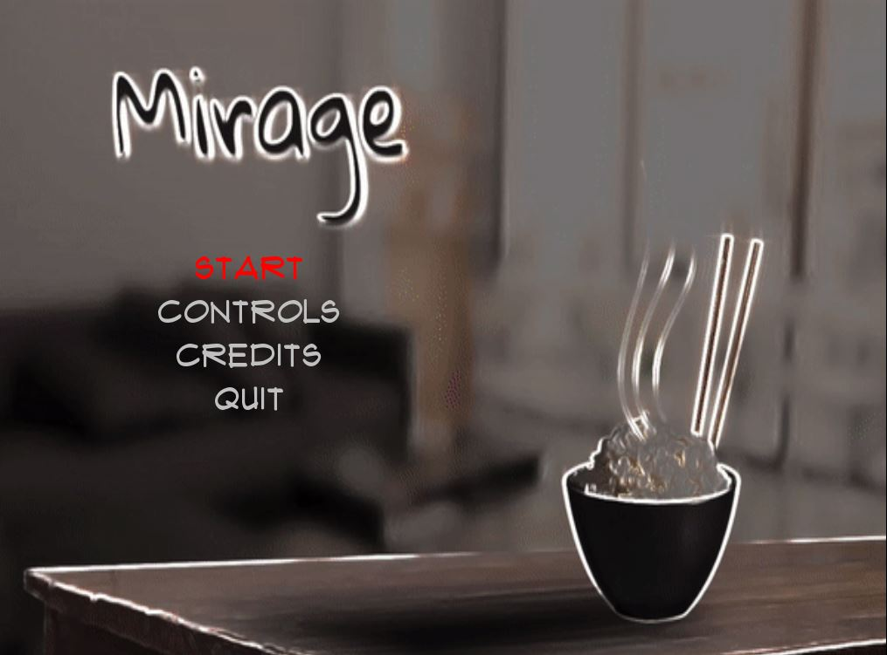 | 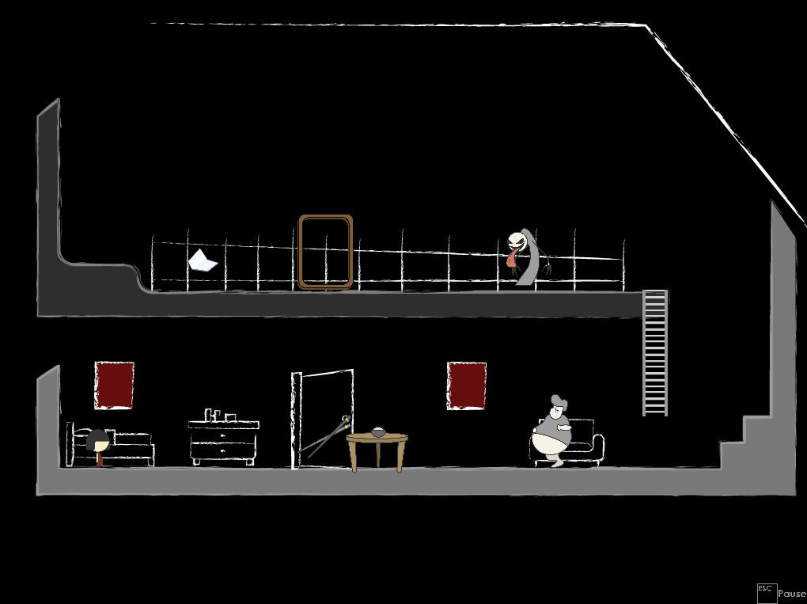

## CS4247 - Graphics Rendering Techniques
---

In this project, we get to render graphics by utilising different techniques. Some include the raster graphics pipeline, viewing and transformation, real-time mapping techniques, real-time shadow algorithms, local reflection models, global illumination, distributed ray tracing, photon mapping, radiosity, volume rendering, image-based rendering and modelling, and strategies for anti-aliasing and photo-realism.

We get to utilise deferred ray-tracing for one of our algorithm implementations.

 Frame #1 | Frame #2
:-------------------------:|:-------------------------:
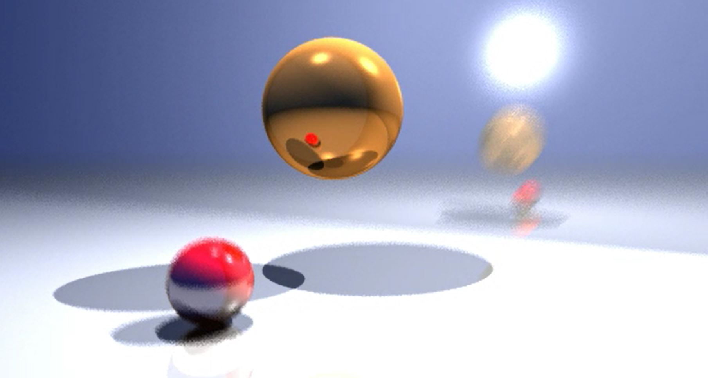 | 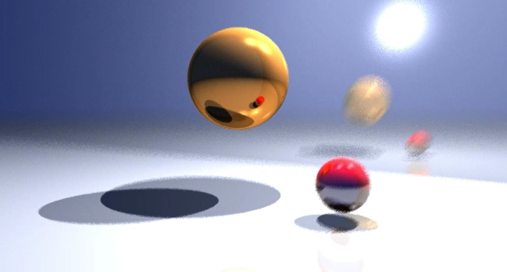

For this project, we are to render a scene in a room using the radiosity method, which utilise diffuse-to-diffuse method for colour computation. This method is similar to how the cornell box is rendered.

 Wireframe | Rendered Scene
:-------------------------:|:-------------------------:
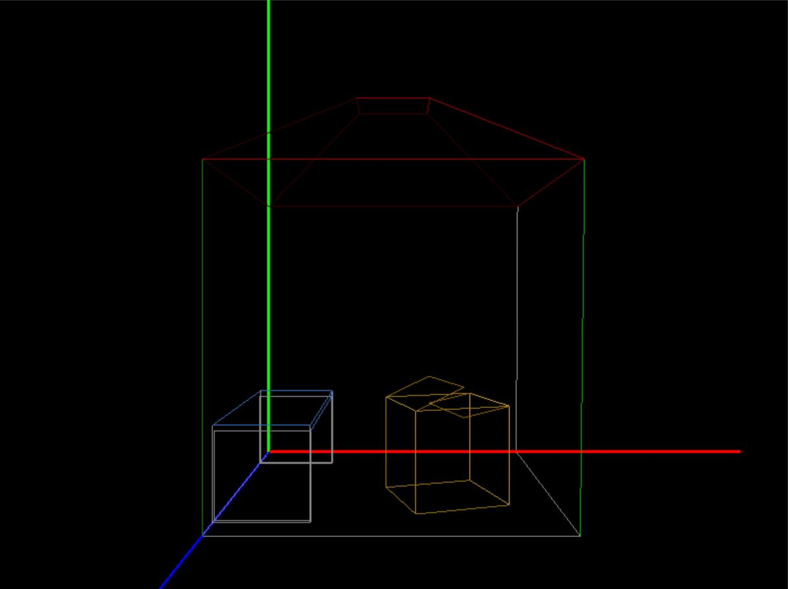 | 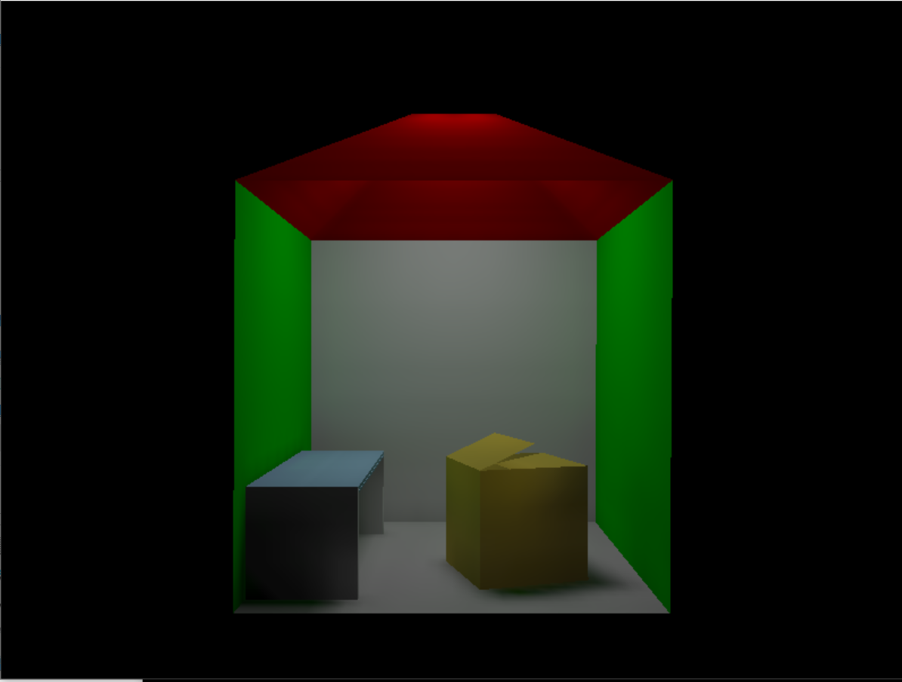

# Special Mentions
Here are some of my other special mentions. Feel free to contact me at my personal email for more information!

My project gallery are as shown below. 

## CS4243 - Computer Vision and Pattern Recognition

This is a pretty fun module where we get to utilise python Open-CV libraries to perform Machine Learning on images.

One such example is utilising feature descriptors of different images to stitch a panorama.

 Sift Descriptors |  Panoramic-stiched image 
:-------------------------:|:-------------------------:
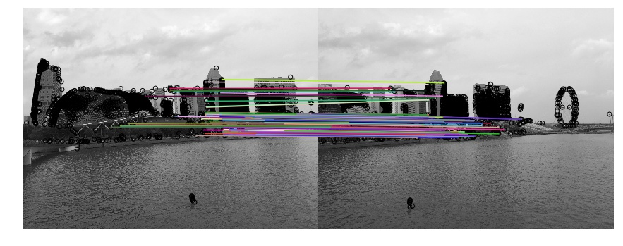 | 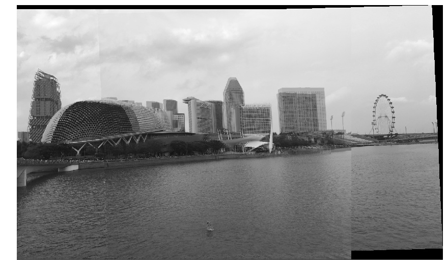

## CS3240 - Interaction Design

Here, I collaborated with a team to develop a VR app showcasing NUS Museum. We even received offer by Hiverlab to utilise intellectual property for showcasing NUS. Unfortunately the rights are not ours and belong solely to NUS.

 Museum VRX | Text on Hover
:-------------------------:|:-------------------------:
  | 

## CS3247 - Game Development Project

This was a very fun module where we get to work together in a team to produce a 3D VR shooting game which utilises music as its rythm. We used unity to import its local assets for the production.

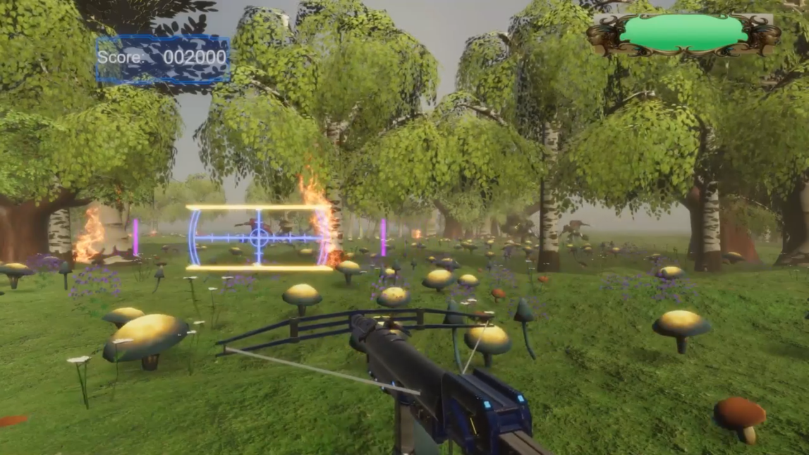

## TUE: Data Engineering

I am so grateful to work with several international students during my exchange semester in the Technical University of Eindhoven, The Netherlands.
We managed to cluster different co-authors across different communities! This was done primarily using python and utilises the iceberg role similarity algorithm .

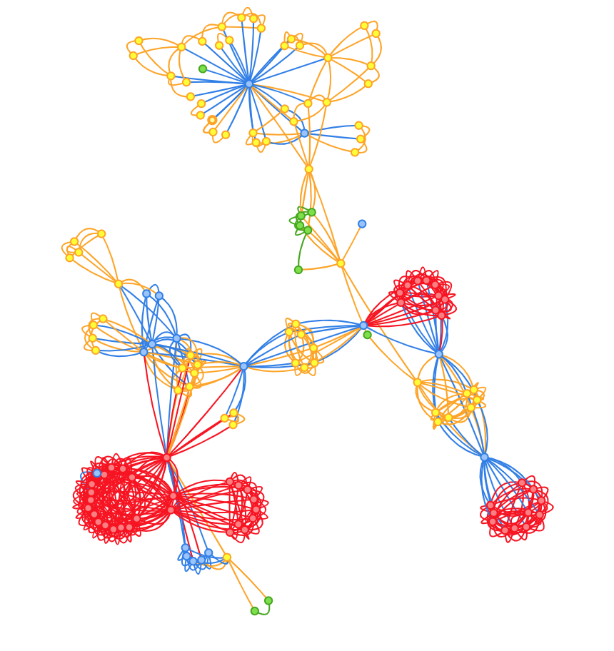

## TUE: Simulation in Computer Graphics

Similarly, I also get to work in a project where we explored simulation of computer graphics using C++ to model how graphics and physics interact with one another to produce a cloth physics visualisation.

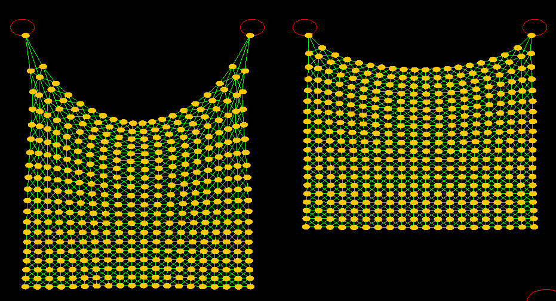

